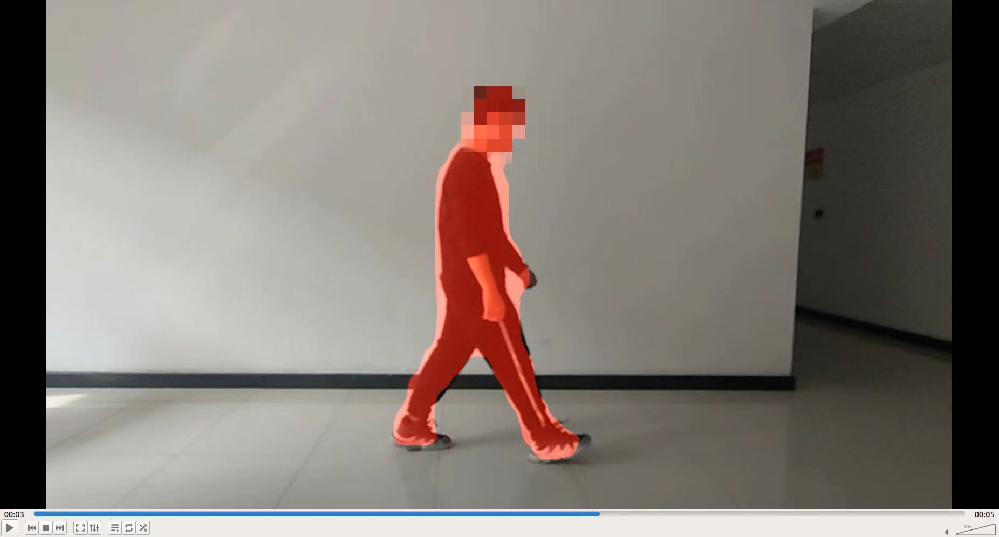
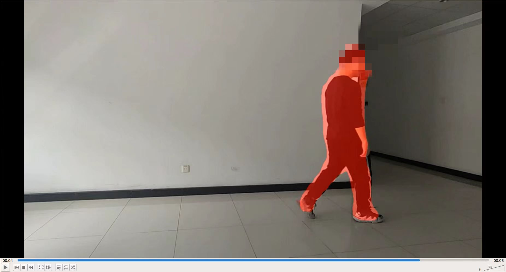
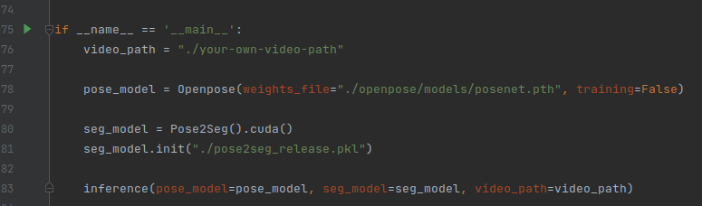

# Pose2Seg Video Demo (Single Person)

## Demo Result
<div align="center">
    
    <br>
    Video Demo Example
</div>

## Installation

``` bash
pip install cython matplotlib tqdm opencv-python scipy pyyaml numpy 
pip install pycocotools
pip install torchvision torch
```

## Download data

- COCO 2017
    - [COCO 2017 Train images [118K/18GB]](http://images.cocodataset.org/zips/train2017.zip)
    - [COCO 2017 Val images [5K/1GB]](http://images.cocodataset.org/zips/val2017.zip)
    - [COCOPersons Train Annotation (person_keypoints_train2017_pose2seg.json) [166MB]](https://github.com/liruilong940607/Pose2Seg/releases/download/data/person_keypoints_train2017_pose2seg.json)
    - [COCOPersons Val Annotation (person_keypoints_val2017_pose2seg.json) [7MB]](https://github.com/liruilong940607/Pose2Seg/releases/download/data/person_keypoints_val2017_pose2seg.json)
    
- OCHuman
    - [images [667MB] & annotations](https://cg.cs.tsinghua.edu.cn/dataset/form.html?dataset=ochuman)
    
**Note**: 
`person_keypoints_(train/val)2017_pose2seg.json` is a subset of `person_keypoints_(train/val)2017.json` (in [COCO2017 Train/Val annotations](http://images.cocodataset.org/annotations/annotations_trainval2017.zip)). We choose those instances with both keypoint and segmentation annotations for our experiments.

## Setup data

The `data` folder should be like this:

    data  
    ├── coco2017
    │   ├── annotations  
    │   │   ├── person_keypoints_train2017_pose2seg.json 
    │   │   ├── person_keypoints_val2017_pose2seg.json 
    │   ├── train2017  
    │   │   ├── ####.jpg  
    │   ├── val2017  
    │   │   ├── ####.jpg  
    ├── OCHuman 
    │   ├── annotations  
    │   │   ├── ochuman_coco_format_test_range_0.00_1.00.json   
    │   │   ├── ochuman_coco_format_val_range_0.00_1.00.json   
    │   ├── images  
    │   │   ├── ####.jpg 

## How to train

``` bash
python train.py
```

**Note**: Currently we only support for single-gpu training.

## How to test

This allows you to test the model on (1) COCOPersons val set and (2) OCHuman val & test set.

``` bash
python test.py --weights last.pkl --coco --OCHuman
```

We retrained our model using this repo, and got similar results with our paper. The final weights can be download [here](https://drive.google.com/file/d/193i8b40MJFxawcJoNLq1sG0vhAeLoVJG/view?usp=sharing).

## Openpose config
Download [pretrained model](https://drive.google.com/open?id=19AIYt2lez5V3x4wFVJvVvWwQpB8uoQp2) (posenet.pth) to {ROOT}/openpose/models

## Demo
### 1. Create input/output dir paths first
```
mkdir video
mkdir output
```
### 2. Config your own video path(.mp4) in demo.py line 76
<div align="center">
    <br>
    Your Own Video Path Config
</div>

### 3. Run the demo.py and the result will be generated in {ROOT}/output/XXX.mp4

## Information for Pose2Seg
*Official* code for the paper "Pose2Seg: Detection Free Human Instance Segmentation"[[ProjectPage]](http://www.liruilong.cn/projects/pose2seg/index.html)[[arXiv]](https://arxiv.org/abs/1803.10683) @ CVPR2019.

The *OCHuman dataset* proposed in our paper is released [here](https://github.com/liruilong940607/OCHumanApi)

<div align="center">

<p> Pipeline of our pose-based instance segmentation framework.</p>
</div>

### Acknowledgment
```
@inproceedings{zhang2019pose2seg,
  title={Pose2seg: Detection free human instance segmentation},
  author={Zhang, Song-Hai and Li, Ruilong and Dong, Xin and Rosin, Paul and Cai, Zixi and Han, Xi and Yang, Dingcheng and Huang, Haozhi and Hu, Shi-Min},
  booktitle={Proceedings of the IEEE/CVF conference on computer vision and pattern recognition},
  pages={889--898},
  year={2019}
}

@InProceedings{cao2017realtime,
  title = {Realtime Multi-Person 2D Pose Estimation using Part Affinity Fields},
  author = {Zhe Cao and Tomas Simon and Shih-En Wei and Yaser Sheikh},
  booktitle = {The IEEE Conference on Computer Vision and Pattern Recognition (CVPR)},
  year = {2017}
  }
```

### Contact
```
ligaoqi02@gmail.com
```
